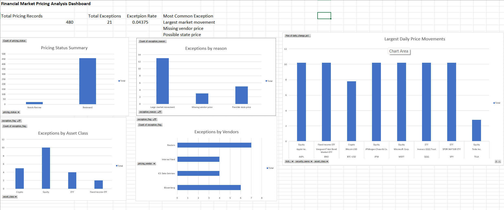

# Financial Market Pricing Analysis

## Project Overview

The **Financial Market Pricing Analysis** project is a portfolio project designed to simulate the type of pricing review and exception monitoring used in financial operations, investment operations, fund servicing, and FinTech environments.

The project analyzes a synthetic financial market pricing dataset to identify daily price movements, pricing exceptions, missing prices, possible stale prices, and vendor-level data quality issues. The goal is to show how an analyst can use **Python, SQL, Excel, and business reporting** to review pricing data and communicate useful insights to operations and finance teams.

This project was built to demonstrate practical entry-level analyst skills for roles such as:

* Financial Analyst
* Operations Analyst
* Business Analyst
* FinTech Analyst
* Data Analyst
* Investment Operations Analyst

---

## Business Problem

Financial institutions depend on accurate daily pricing data for securities, ETFs, funds, crypto assets, and fixed income products. If pricing data is missing, stale, or unusually different from the previous close, it can create reporting errors, valuation issues, client service problems, and operational risk.

A pricing operations team needs a clear process to review daily prices, identify exceptions, investigate unusual movements, and summarize the results for business users.

This project answers questions such as:

* Which securities had the largest daily price movements?
* Which pricing records should be flagged for review?
* Are there missing vendor prices?
* Are there possible stale prices?
* Which pricing vendors had the highest exception activity?
* Which asset classes had the most pricing exceptions?
* How can pricing exceptions be summarized in a dashboard for business users?

---

## Tools and Technologies Used

* **Python** — data creation, cleaning, analysis, and summary calculations
* **Pandas** — data manipulation and grouping
* **NumPy** — numerical operations and missing value handling
* **Matplotlib** — visual analysis in the notebook
* **Jupyter Notebook** — step-by-step analysis workflow
* **SQL** — business-focused pricing queries
* **Excel** — PivotTables, KPI cards, and dashboard creation
* **GitHub** — project documentation and version control

---

## Dataset Description

This project uses a **synthetic dataset** created for portfolio and learning purposes. The dataset is designed to look like realistic financial market pricing data, but it does not contain any confidential company, client, or employer information.

The dataset includes:

* Pricing date
* Security ID
* Ticker
* Security name
* Asset class
* Currency
* Pricing vendor
* Previous close price
* Current price
* Daily change percentage
* Trading volume
* Pricing status
* Exception flag
* Exception reason

The dataset includes several asset classes, including equities, ETFs, crypto, and fixed income ETF records. It also includes realistic pricing exception scenarios such as missing vendor prices, possible stale prices, and large market movements.

---

## Repository Structure

```text
financial-market-pricing-analysis/
│
├── data/
│   └── market_pricing_data.csv
│
├── notebooks/
│   └── pricing_analysis.ipynb
│
├── sql/
│   └── pricing_analysis_queries.sql
│
├── dashboard/
│   ├── market_pricing_dashboard.xlsx
│   └── excel_dashboard_screenshot.png
│
├── reports/
│   └── insights.md
│
├── requirements.txt
└── README.md
```

---

## Project Workflow

### 1. Data Creation

A synthetic financial market pricing dataset was created inside a Jupyter Notebook. The dataset was designed to represent daily pricing records across multiple securities, vendors, and asset classes.

The data includes normal pricing records as well as exception records that require review.

### 2. Data Quality Review

The dataset was reviewed for missing values, unusual records, and pricing issues. Missing vendor prices and possible stale prices were identified as important data quality concerns.

### 3. Pricing Exception Analysis

Pricing records were grouped by pricing status and exception reason to understand how many records were successfully reviewed and how many required further investigation.

### 4. Asset Class Analysis

The analysis compared pricing exceptions across asset classes to identify which types of instruments had higher exception activity.

### 5. Vendor-Level Review

Pricing vendors were compared based on exception counts and exception rates. This helps show which vendors may require closer monitoring or follow-up.

### 6. Largest Daily Price Movements

The project identified securities with the largest daily percentage changes. These records are important because large price movements may be valid market events or possible pricing errors that require review.

### 7. SQL Analysis

SQL queries were written to support business review, including exception counts, vendor summaries, asset class summaries, missing price checks, stale price checks, and overall pricing summary metrics.

### 8. Excel Dashboard

An Excel dashboard was created using PivotTables, KPI cards, and charts. The dashboard gives business users a quick view of total records, total exceptions, exception rate, exception reasons, vendor performance, asset class trends, and largest daily movements.

---

## Dashboard Preview



---

## Key Analysis Areas

The project focuses on the following analysis areas:

* Total pricing records reviewed
* Total pricing exceptions
* Overall exception rate
* Pricing status summary
* Exceptions by reason
* Exceptions by asset class
* Exceptions by pricing vendor
* Largest daily price movements
* Missing vendor prices
* Possible stale prices
* Business recommendations for pricing review

---

## Key Insights

* Most pricing records were reviewed successfully without exceptions.
* A smaller number of records required review due to missing prices, possible stale prices, or large market movements.
* Vendor-level exception review can help operations teams identify pricing sources that may need closer monitoring.
* Asset class comparison helps prioritize review work based on where exception activity is higher.
* Large daily movements should be reviewed carefully to confirm whether they are valid market movements or possible pricing errors.
* A dashboard can help financial operations teams monitor daily pricing issues more efficiently.

---

## Business Recommendations

Based on the analysis, the following recommendations were made:

* Review all records marked as **Needs Review** before final reporting.
* Investigate missing vendor prices quickly to reduce valuation and reporting risk.
* Monitor vendors with higher exception rates.
* Track repeated exceptions by security, vendor, and asset class.
* Use dashboards to help operations teams prioritize daily pricing review work.
* Maintain historical exception tracking to identify recurring pricing issues.

---

## Skills Demonstrated

This project demonstrates the following skills:

* Financial data analysis
* Pricing exception review
* Data quality checking
* SQL querying
* Python data analysis
* Pandas data manipulation
* Excel PivotTables
* Excel dashboard creation
* Business insight reporting
* Operational risk awareness
* GitHub documentation
* Portfolio project organization

---

## How to Run This Project

### 1. Clone the Repository

```bash
git clone https://github.com/fitsa251/financial-market-pricing-analysis.git
```

### 2. Navigate Into the Project Folder

```bash
cd financial-market-pricing-analysis
```

### 3. Install Requirements

```bash
pip install -r requirements.txt
```

### 4. Open the Jupyter Notebook

Open the notebook below and run the cells:

```text
notebooks/pricing_analysis.ipynb
```

### 5. Review the Excel Dashboard

Open the Excel dashboard file:

```text
dashboard/market_pricing_dashboard.xlsx
```

---

## Project Files

| File                                       | Description                                               |
| ------------------------------------------ | --------------------------------------------------------- |
| `data/market_pricing_data.csv`             | Synthetic financial market pricing dataset                |
| `notebooks/pricing_analysis.ipynb`         | Python notebook for data creation, cleaning, and analysis |
| `sql/pricing_analysis_queries.sql`         | SQL queries for pricing exception analysis                |
| `dashboard/market_pricing_dashboard.xlsx`  | Excel dashboard workbook                                  |
| `dashboard/excel_dashboard_screenshot.png` | Dashboard preview image                                   |
| `reports/insights.md`                      | Final business insights and recommendations               |
| `requirements.txt`                         | Python package requirements                               |

---

## Project Status

**Completed**

This project is complete and ready to be included in a professional data, finance, operations, or FinTech analyst portfolio.

---

## Important Note

This project uses synthetic data only. No confidential company data, client data, or employer data is used.
